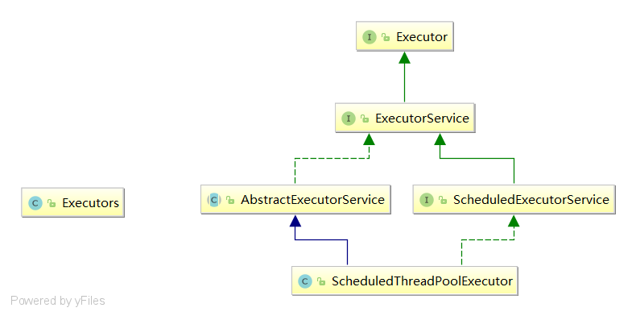

# 13-并发编程之线程池

​	Java中的线程池是通过Executor框架实现的，该框架中用到了Executor、Executors、ExecutorService、ExecutorPoolExecutor这几个类。


> 线程池执行流程

* 创建线程池，等待提交过来的任务请求
* 当调用execute()方法添加一个任务时，线程池会做如下判断
  * 如果正在允许的线程个数小于corePoolSize，那么马上创建线程允许这个任务
  * 如果正在运行的线程数量大于等于corePoolSize，那么将这个任务添加到等待队列中
  * 如果这时候等待队列满了且正在运行的线程数量小于maximumPoolSize,那么将会创建新的非核心线程立即运行这个任务
  * 如果这时候等待队列满了且正在运行的线程数量大于等于maximumPoolSize，那么线程池将会执行饱和拒绝策略。
* 当一个线程执行完成任务，它会从队列中取下一个任务来执行
* 当线程无任务执行时，超过空闲时间(keepAliveTime)时，线程池会判断当前线程数大于corePoolSize，那么将会保留corePoolSize个线程，其余的都销毁。
* 所以线程池的所有任务完成后，线程池中的线程个数将会收缩到corePoolSize个。





## 定长线程池

```java
ExecutorService threadPool = Executors.newFixedThreadPool(5);
//构造方法
public static ExecutorService newFixedThreadPool(int nThreads) {
    return new ThreadPoolExecutor(nThreads, nThreads,
                                  0L, TimeUnit.MILLISECONDS,
                                  new LinkedBlockingQueue<Runnable>());
}
```


## 单线程线程池

```java
ExecutorService threadPool = Executors.newSingleThreadExecutor();
//构造方法
public static ExecutorService newSingleThreadExecutor() {
    return new FinalizableDelegatedExecutorService
        (new ThreadPoolExecutor(1, 1,
                                0L, TimeUnit.MILLISECONDS,
                                new LinkedBlockingQueue<Runnable>()));
}
```

## 缓存线程池

```java
ExecutorService threadPool = Executors.newCachedThreadPool();
//构造方法
public static ExecutorService newCachedThreadPool() {
    return new ThreadPoolExecutor(0, Integer.MAX_VALUE,
                                  60L, TimeUnit.SECONDS,
                                  new SynchronousQueue<Runnable>());
}
```


## 线程池几个重要参数

==**ThreadPoolExecutor类有4个构造方法**==

```java
public ThreadPoolExecutor(int corePoolSize,
                          int maximumPoolSize,
                          long keepAliveTime,
                          TimeUnit unit,
                          BlockingQueue<Runnable> workQueue) {
    this(corePoolSize, maximumPoolSize, keepAliveTime, unit, workQueue,
         Executors.defaultThreadFactory(), defaultHandler);
}
public ThreadPoolExecutor(int corePoolSize,
                          int maximumPoolSize,
                          long keepAliveTime,
                          TimeUnit unit,
                          BlockingQueue<Runnable> workQueue,
                          RejectedExecutionHandler handler) {
    this(corePoolSize, maximumPoolSize, keepAliveTime, unit, workQueue,
         Executors.defaultThreadFactory(), handler);
}
public ThreadPoolExecutor(int corePoolSize,
                          int maximumPoolSize,
                          long keepAliveTime,
                          TimeUnit unit,
                          BlockingQueue<Runnable> workQueue,
                          ThreadFactory threadFactory) {
    this(corePoolSize, maximumPoolSize, keepAliveTime, unit, workQueue,
         threadFactory, defaultHandler);
}
public ThreadPoolExecutor(int corePoolSize,
                          int maximumPoolSize,
                          long keepAliveTime,
                          TimeUnit unit,
                          BlockingQueue<Runnable> workQueue,
                          ThreadFactory threadFactory,
                          RejectedExecutionHandler handler) {
    if (corePoolSize < 0 ||
        maximumPoolSize <= 0 ||
        maximumPoolSize < corePoolSize ||
        keepAliveTime < 0)
        throw new IllegalArgumentException();
    if (workQueue == null || threadFactory == null || handler == null)
        throw new NullPointerException();
    this.corePoolSize = corePoolSize;
    this.maximumPoolSize = maximumPoolSize;
    this.workQueue = workQueue;
    this.keepAliveTime = unit.toNanos(keepAliveTime);
    this.threadFactory = threadFactory;
    this.handler = handler;
}
```

### 线程池七大参数

> corePoolSize: 线程池中的常驻核心线程数


> maximumPoolSize:线程池能够容纳同时执行的最大线程数,此值必须大于等于1


> keepAliveTime:多余的空闲线程的存活时间

​	当前线程池线程数量超过corePoolSize后，当空闲时间达到keepAliveTime时，多余线程就会被销毁直到剩余corePoolSize个线程为止。

> unit:keepAliveTime的单位


> workQueue:任务队列，被提交但尚未被执行的任务队列


> threadFatctory:表示生产线程池中工作线程的线程工厂，用于创建线程一般默认即可。

​	一般使用默认的线程工厂

> handler:拒绝策略

​	handler:拒绝策略，表示当队列满了并且工作线程大于等于线程池的最大线程数(maximumPoolSize)时，如何处理剩余请求。


## 线程池拒绝策略


### AbortPolicy

​	当任务添加到线程池中被拒绝时，它将抛出 RejectedExecutionException 异常。

### CallerRunsPolicy

 	当任务添加到线程池中被拒绝时，会在线程池当前正在运行的Thread线程池中处理被拒绝的任务。

"调用者运行"一种调用机制，该策略既不会抛弃任务，也不会抛出异常，而是将某些任务回退之任务调用者处理，

从而降低新任务的流量。

### DiscardOldestPolicy

​	当任务添加到线程池中被拒绝时，线程池会放弃等待队列中最旧的未处理任务，然后将被拒绝的任务添加到等待队列中。

### DiscardPolicy

​	当任务添加到线程池中被拒绝时，线程池将丢弃被拒绝的任务。


## 线程池核心线程数的个数

### IO密集型

​	IO密集型任务，既该任务需要大量的IO，即大量的阻塞。

​	在单线程上运行IO密集型的任务会导致浪费大量的CPU运算能力在等待IO上

​	所以在IO密集型任务中使用多线程可以大大的加速程序运行，即使在单核CPU上，这种假设主要就是利用了被浪费的阻塞时间。

​	IO密集型时，大部分线程都阻塞，故需要多配置线程数:参考公式 CPU核数/1-阻塞系数(阻塞系数在0.8-0.9之间)

例如： 8核CPU   8/1-0.9=80个线程数

### CPU密集型

​	CPU密集型的意思就是该类任务需要大量的运算，而没有阻塞，CPU一直全速运行。

​	CPU密集型任务只有在真正的多核CPU上才能得到加速(通过多线程)。

​	而在单核CPU上就是一个悲剧，无论你开几个线程，真正干活的就只有一个线程，因为该类任务没有阻塞，一直有一个线程在占用CPU运算。

​	CPU使用率较高(也就是一些复制运算，逻辑处理)，所以线程数一般只需要CPU核数的线程就可以了。CPU类型在开发中多出现在一些业务复杂计算核逻辑处理过程。

​	CPU密集型任务配置尽量少的线程数: 一般公式: CPU核心数+1 个线程数