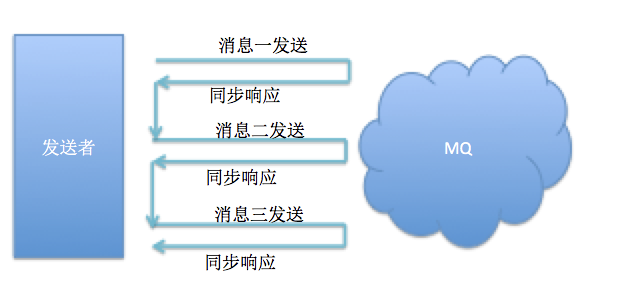

# 消息队列


## 1、消息队列简介

### 1.1、什么是消息队列?

​		“消息”是在两台计算机间传送的数据单位。消息可以非常简单，例如只包含文本字符串；也可以更复杂，可能包含嵌入对象。
​		消息被发送到队列中。“消息队列”是在消息的传输过程中保存消息的容器。消息队列管理器在将消息从它的源中继到它的目标时充当中间人。队列的主要目的是提供路由并保证消息的传递；如果发送消息时接收者不可用，消息队列会保留消息，直到可以成功地传递它。

​		消息队列：分为消息(Message)和队列(Queue)，就是把消息存储在队列中，其核心还是队列。

​		队列：FIFO(先进先出)

### 1.2、为什么使用消息队列

​		主要解决应用解耦，异步消息，提升性能，流量削锋等问题，实现高性能，高可用，可伸缩和最终一致性架构。

### 1.3、有哪些消息中间件

​	目前使用较多的消息队列有：

* ActiveMQ
* RabbitMQ【推荐】
* Kafka【推荐】
* RocketMQ【推荐】

## 2、消息队列的选型

### 2.1、消息中间件选型依据

​		消息中间件的选型需要根据系统的业务需求来选择，主要是针对一下几点来选型:

* 客户端支持
* 吞吐量
* 基于大数据
* 高可用
* 消息可靠性
* 功能特性
* 社区活跃性(活跃性高的MQ，在bug修复、性能提升、新功能开发、学习成本有优势)
* 可扩展性(基于哪种语言开发绝对了定制mq的难易度)

### 2.2、消息中间件的比较

> RocketMQ官方比较

[rocketmq官网比较列表](http://rocketmq.apache.org/docs/motivation/)

> 常用特性比较

| 特性                    | ActiveMQ                                                     | RabbitMQ                                                     | RocketMQ                                                     |                            Kafka                             |
| ----------------------- | ------------------------------------------------------------ | ------------------------------------------------------------ | ------------------------------------------------------------ | :----------------------------------------------------------: |
| 单机吞吐量              | 万级，吞吐量比RocketMQ和Kafka要第一个数量级                  | 万级，吞吐量比RocketMQ和Kafka要第一个数量级                  | 10万级，RocketMQ也是可以支撑高吞吐的一种MQ                   | 10万级别，这是Kafka最大的优点，就是吞吐量高。一般配合大数据类的系统来进行实时数据计算，日志采集等场景。 |
| topic数量对吞吐量的影响 |                                                              |                                                              | topic可以达到几百，几千个的级别，吞吐量会较小幅度的下降，这是RocketMQ的一大优势，在同等机器下，可以支撑大量的topic。 | topic从几十个到几百个的时候，吞吐量会大幅度下降。所以在同等机器下，Kafka尽量保证topic数量不要过多。如果要支撑大规模topic，需要增加更多机器资源。 |
| 时效性                  | ms级                                                         | 微妙级，这是rabbitMq的一大特点，延迟是最低的                 | ms级                                                         |                         延迟在ms以内                         |
| 可用性                  | 高，基于主从框架实现高可用性                                 | 高，基于主从架构实现高可用性                                 | 非常高，分布式架构                                           | 非常高，kafka是分布式的，一个数据多个副本，少数机器宕机，不会丢失数据，不会导致不可用 |
| 消息可靠性              | 有较低的概率丢失数据                                         |                                                              | 经过参数优化配置可以做到0丢失                                |             经过参数优化配置，消息可以做到0丢失              |
| 功能支持                | MQ领域的功能及其完备                                         | 基于erlang开发，所以并发能力很强，性能及其好，延时很低       | MQ功能较为完善，还是分布式的，扩展性好                       | 功能较为简单，主要支持简单的MQ功能，在大数据领域的实时计算以及日志采集被大规模使用，是事实上的标准 |
| 优劣势总结              | 非常成熟，功能强大，在业内大量的公司以及项目中都有应用。偶尔会有较低概率的丢失消息。而且现在社区以及国内应用都越来越少，官方社区现在对ActiveMQ维护越来越少，几个月才发布一个版本。而且确实主要是基于解耦和异步来用的，较少在大规模吞吐的场景中使用。 | erlang语言开发，性能及其好，延时很低：吞吐量到万级，MQ功能比较完备，而且开源提供的管理界面非常棒，用起来很好用。社区相对比较活跃，几乎每个月都发布几个版本。在国内公司用rabbitmq也比较多一些 但是问题也是显而易见的，RabbitMQ确实吞吐量会低一些，这是因为他做的实现机制比较重。 而且erlang开发，国内有几个公司有实力做erlang源码级别的研究和定制？如果说你没这个实力的话，确实偶尔会有一些问题，你很难去看懂源码，你公司对这个东西的掌控很弱，基本职能依赖于开源社区的快速维护和修复bug。 而且rabbitmq集群动态扩展会很麻烦，不过这个我觉得还好。其实主要是erlang语言本身带来的问题。很难读源码，很难定制和掌控。 | 接口简单易用，而且毕竟在阿里大规模应用过，有阿里品牌保障 日处理消息上百亿之多，可以做到大规模吞吐，性能也非常好，分布式扩展也很方便，社区维护还可以，可靠性和可用性都是ok的，还可以支撑大规模的topic数量，支持复杂MQ业务场景 而且一个很大的优势在于，阿里出品都是java系的，我们可以自己阅读源码，定制自己公司的MQ，可以掌控 社区活跃度相对较为一般，不过也还可以，文档相对来说简单一些，然后接口这块不是按照标准JMS规范走的有些系统要迁移需要修改大量代码 还有就是阿里出台的技术，你得做好这个技术万一被抛弃，社区黄掉的风险，那如果你们公司有技术实力我觉得用RocketMQ挺好的 | kafka的特点其实很明显，就是仅仅提供较少的核心功能，但是提供超高的吞吐量，ms级的延迟，极高的可用性以及可靠性，而且分布式可以任意扩展 同时kafka最好是支撑较少的topic数量即可，保证其超高吞吐量 而且kafka唯一的一点劣势是有可能消息重复消费，那么对数据准确性会造成极其轻微的影响，在大数据领域中以及日志采集中，这点轻微影响可以忽略 这个特性天然适合大数据实时计算以及日志收集 |

### 2.3、RocketMQ

​		通过以上消息中间件的比较，我选择了Rocke他MQ、下文将带领大家一步一步解剖RocketMQ的实现原理。


## 3、RocketMQ初识

### 3.1、RocketMQ是什么?

​		RocketMQ是一款分布式，队列模型的消息中间件，由阿里巴巴研发，借鉴惨了JMS规范的MQ实现，更参考了优秀的开源消息中间件KAFKA，并且结合阿里实际业务需求，在天猫双十一的场景，实现义务消峰，分布式事务的优秀框架。目前开源稳定版本为4.4.0，最新版本为4.5.1。阿里巴巴把RocketMQ捐赠给了Apache。[官网网址](http://rocketmq.apache.org/)

### 3.2 RocketMQ特性

* 是一个队列模型的消息中间件，具有高性能、高可靠、高实时、分布式特点；
* Producer、Consumer、队列都可以分布式；
* Producer向一些队列轮流发送消息，队列集合称为Topic，Consumer如果做广播消费，则一个consumer
* 例消费这个Topic对应的所有队列，如果做集群消费，则多个Consumer实例平均消费这个topic对应的队列集合；
* 能够保证严格的消息顺序；
* 提供丰富的消息拉取模式；
* 高效的订阅者水平扩展能力；
* 实时的消息订阅机制；
* 亿级消息堆积能力；

* 较少的依赖


### 3.3 如何快速上手RocketMQ

​			学习一个新技术，最简单的方式就是通过阅读官方文档，查看官方示例来学习这门技术，在RocketMQ官网上为我们提供了许多案例，下文我们一起学习官方案例。


## 4. RocketMQ入门

### 4.1、RocketMQ安装

> 下载地址: 

[**http://mirrors.tuna.tsinghua.edu.cn/apache/rocketmq/4.4.0/rocketmq-all-4.4.0-source-release.zip**](

> 安装步骤

```shell
//解压编译

> unzip rocketmq-all-4.4.0-source-release.zip
> cd rocketmq-all-4.4.0/
> mvn -Prelease-all -DskipTests clean install -U
> cd distribution/target/apache-rocketmq

//Start Name Server

> nohup sh bin/mqnamesrv &
> tail -f ~/logs/rocketmqlogs/namesrv.log
The Name Server boot success...

//Start Broker

> nohup sh bin/mqbroker -n localhost:9876 &
> tail -f ~/logs/rocketmqlogs/broker.log 
The broker[%s, 172.30.30.233:10911] boot success...

//Shutdown Servers

> sh bin/mqshutdown broker
The mqbroker(36695) is running...
Send shutdown request to mqbroker(36695) OK

> sh bin/mqshutdown namesrv
The mqnamesrv(36664) is running...
Send shutdown request to mqnamesrv(36664) OK
```

> 启动命令

```shell
nohup sh bin/mqbroker -n localhost:9876 -c ./conf/broker.conf
```

> 启动参数调整

​		在启动RocketMQ时，如果内存不足，需要调整apache-rocketmq/bin/runbroker.sh的jvm参数，

* 调整Xms参数，初始化堆内存
* 调整Xmx参数，最大堆内存
* 调整Xmn参数，调整年轻代内存

### 4.2、RocketMQ之HelloWorld

#### 4.2.1、引入依赖

```xml
<dependency>
    <groupId>org.apache.rocketmq</groupId>
    <artifactId>rocketmq-client</artifactId>
    <version>4.4.0</version>
</dependency>
```


#### 4.2.2、RocketMQ模块组成

​		我们知道消息队列，是由消息(Message)和队列(Queue)两部分构成。我们需要思考一下，消息是怎么产生的、如何传递给队列的、队列中放入消息后如何处理？

​		按照一般思路我们可以知道，必须有一个角色来生产消息、一个角色来处理消息、中间的队列就是我们所说的消息中间件。

​		在消息中间件中，我们把生产消息的角色叫做: 生产者；处理消息的角色叫做：消费者；存储中转消息的角色叫做：消息中间件，这儿是具体的产品RocketMQ。

> 思考下面的问题:

* 消息生产者发送完消息了，怎么知道是否发送成功呢，是不是需要一个返回结果呢？
* 消费者从RocketMQ中消费了消息，是不是需要告诉消息中间件，是否消费成功？
* 假如生产者往RocketMQ中生产消息失败了怎么办，RocketMQ如何处理？
* 假如消费者从RocketMQ中消费消息失败了怎么办，RocketMQ处理合理，我们的程序如何处理？


按照我们以上的思路，我们可以看下下面的例子

> 生产者代码

```java
//配置类
public class Config {
    public static final String NAME_ADDR = "39.104.164.68:9876";
}
//生产者代码
public static void main(String[] args) {
    //创建一个消息生产者
    DefaultMQProducer producer = new DefaultMQProducer();
    //设置生产者组
    producer.setProducerGroup("one_producer");
    //设置消息中间件的NameAddress
    producer.setNamesrvAddr(Config.NAME_ADDR);

    try {
        //启动生产者
        producer.start();

        String[] tags = {"tag_a", "tag_b", "tag_c","tag_d","tag_e"};
        Message message;
        for (int i = 0; i < 5; i++) {
            //构建消息对象
            message = new Message("one_topic", tags[i % tags.length], "key" + i, ("produce" + i +(tags[i % tags.length])).getBytes());
            //生产者发送消息，然后返回结果
            SendResult sendResult = producer.send(message);
            //输出返回结果
            System.out.println("发送消息:" +sendResult);
        }
        //关闭生产者
        producer.shutdown();
    } catch (Exception e) {
        e.printStackTrace();
    }

}
```

> 消费者代码

```java
//消费者
public static void main(String[] args) {
    //创建一个消费者
    DefaultMQPushConsumer consumer = new DefaultMQPushConsumer();
    //设置消费者组
    consumer.setConsumerGroup("n_consumer");
    //设置消息中间件的nameAddress
    consumer.setNamesrvAddr(Config.NAME_ADDR);
    //设置获取消息的位置
    consumer.setConsumeFromWhere(ConsumeFromWhere.CONSUME_FROM_FIRST_OFFSET);

    try {
        //消费者订阅消息
        consumer.subscribe("one_topic","tag_a || tag_d");
    } catch (MQClientException e) {
        e.printStackTrace();
    }
    //注册消息监听
    consumer.registerMessageListener(new MessageListenerConcurrently() {
        @Override
        public ConsumeConcurrentlyStatus consumeMessage(List<MessageExt> msgs, ConsumeConcurrentlyContext context) {
            //获取消息内容，然后处理完成后返回消费成功状态：ConsumeConcurrentlyStatus.CONSUME_SUCCESS
            System.out.println(new String(msgs.get(0).getBody()));
            return ConsumeConcurrentlyStatus.CONSUME_SUCCESS;
        }
    });
    try {
        //启动消费者
        consumer.start();
    } catch (MQClientException e) {
        e.printStackTrace();
    }
}
```

> 思考：

从上面的生产者和消费者的示例代码中我们可以知道，生产者和消费者之间有一些关联，我们首先看下生产者、消费者代码

```java
//构建消息对象
Message message = new Message("one_topic", tags[i % tags.length], "key" + i, ("produce" + i +(tags[i % tags.length])).getBytes());
//Message构造器
org.apache.rocketmq.common.message.Message#Message(java.lang.String, java.lang.String, java.lang.String, byte[])
//构建消息需要topic、tags、keys、body    
public Message(String topic, String tags, String keys, byte[] body) {
    this(topic, tags, keys, 0, body, true);
}

public Message(String topic, String tags, String keys, int flag, byte[] body, boolean waitStoreMsgOK) {
    this.topic = topic;
    this.flag = flag;
    this.body = body;

    if (tags != null && tags.length() > 0)
        this.setTags(tags);

    if (keys != null && keys.length() > 0)
        this.setKeys(keys);

    this.setWaitStoreMsgOK(waitStoreMsgOK);
}


//消费者订阅消息，订阅消息时指定了topic
consumer.subscribe("one_topic","tag_a || tag_d");
org.apache.rocketmq.client.consumer.DefaultMQPushConsumer#subscribe(java.lang.String, java.lang.String)
    
@Override
public void subscribe(String topic, String subExpression) throws MQClientException {
    this.defaultMQPushConsumerImpl.subscribe(topic, subExpression);
}
```

#### 4.2.3、运行结果

```java
//生产者日志--------------
发送消息:SendResult [sendStatus=SEND_OK, msgId=0A164ED8559018B4AAC23D67C9C80000, offsetMsgId=2768A44400002A9F00000000000B4E1C, messageQueue=MessageQueue [topic=one_topic, brokerName=broker-a, queueId=3], queueOffset=99]
发送消息:SendResult [sendStatus=SEND_OK, msgId=0A164ED8559018B4AAC23D67CA2F0001, offsetMsgId=2768A44400002A9F00000000000B4ED6, messageQueue=MessageQueue [topic=one_topic, brokerName=broker-a, queueId=0], queueOffset=102]
发送消息:SendResult [sendStatus=SEND_OK, msgId=0A164ED8559018B4AAC23D67CA580002, offsetMsgId=2768A44400002A9F00000000000B4F90, messageQueue=MessageQueue [topic=one_topic, brokerName=broker-a, queueId=1], queueOffset=101]
发送消息:SendResult [sendStatus=SEND_OK, msgId=0A164ED8559018B4AAC23D67CA810003, offsetMsgId=2768A44400002A9F00000000000B504A, messageQueue=MessageQueue [topic=one_topic, brokerName=broker-a, queueId=2], queueOffset=98]
发送消息:SendResult [sendStatus=SEND_OK, msgId=0A164ED8559018B4AAC23D67CAA90004, offsetMsgId=2768A44400002A9F00000000000B5104, messageQueue=MessageQueue [topic=one_topic, brokerName=broker-a, queueId=3], queueOffset=100]

Process finished with exit code 0
    
//消费者日志--------------
produce0tag_a
produce3tag_d

```

​		可以看出生产者生产了5条消息，消费者消费了2条消息，从生产者生产的消息和消费者消息的消息可以看出，消费者时通过topic和tags过滤消息的，消费者在订阅时，consumer.subscribe("one_topic","tag_a || tag_d");那么只消费了tag_a、tag_d的消息


#### 4.2.4、引入新的名词

​		引入新的名词：

* topic
* tags
* groupName

topic和tags后面的文章我们详细的介绍.

https://my.oschina.net/javamaster/blog/2051703


### 4.3、Topic、Tags和GroupName

#### 4.3.1、Topic

​	Topic官方定义

```
Topic是生产者在发送消息和消费者在拉取消息的类别。Topic与生产者和消费者之间的关系非常松散。具体来说，一个Topic可能有0个，一个或多个生产者向它发送消息；相反，一个生产者可以发送不同类型Topic的消息。类似的，消费者组可以订阅一个或多个主题，只要该组的实例保持其订阅一致即可。
```

> 生产者绑定Topic是在构建消息时指定Topic

```java
//构建消息对象
message = new Message("one_topic", tags[i % tags.length], "key" + i, ("produce" + i +(tags[i % tags.length])).getBytes());
                //生产者发送消息，然后返回结果
```

> 消费者绑定Topic是在订阅时指定Topic

```java
//消费者订阅消息，订阅消息时指定了topic
consumer.subscribe("one_topic","tag_a || tag_d");
```

#### 4.3.2、Tags


> ​    标签，换句话的意思就是子主题，为用户提供了额外的灵活性。有了标签，来自同一业务模块的具有不同目的的消息可以具有相同的主题和不同的标记。标签有助于保持代码的清晰和连贯，同时标签也方便RocketMQ提供的查询功能。


```java
//消费者订阅消息，订阅消息时指定了topic,
consumer.subscribe("one_topic","tag_a || tag_d");
//*代表消费这个主题下的所有消息
consumer.subscribe("one_topic","*");
```


#### 4.3.3、GroupName

和现实世界中一样，RocketMQ中也有组的概念。代表具有相同角色的生产者组合或消费者组合，称为生产者组或消费者组。

​    作用是在集群HA的情况下，一个生产者down之后，本地事务回滚后，可以继续联系该组下的另外一个生产者实例，不至于导致业务走不下去。在消费者组中，可以实现消息消费的负载均衡和消息容错目标。

​    另外，有了GroupName，在集群下，动态扩展容量很方便。只需要在新加的机器中，配置相同的GroupName。启动后，就立即能加入到所在的群组中，参与消息生产或消费。

​    在Producer中使用GroupName：

```
DefaultMQProducer producer = new DefaultMQProducer("group_name_1");// 使用GroupName来初始化Producer，如果不指定，就会使用默认的名字：DEFAULT_PRODUCER
//或者
//创建一个消息生产者
DefaultMQProducer producer = new DefaultMQProducer();
//设置生产者组
producer.setProducerGroup("one_producer");
```

​    在Consumer中使用GroupName：

```java
DefaultMQPushConsumer consumer = new DefaultMQPushConsumer("group_name_1");// 使用GroupName来初始化Consumer，如果不指定，就会使用默认的名字：DEFAULT_CONSUMER

//或者
//创建一个消费者
DefaultMQPushConsumer consumer = new DefaultMQPushConsumer();
//设置消费者组
consumer.setConsumerGroup("n_consumer");
```

### 4.4、总结

​		生产者和消费者之间通过topic关联，消费者通过tags来过滤消息。GroupName对生产者和消费者进行逻辑分组。后面将会逐一介绍RocketMQ的特性。

​		

## 5、消息发送方式

​			上文中我们实现了生产者发送消息时，消息返回是同步的，性能达不到要求，需要异步发送消息。

RocketMQ支持以下发送方式:

* 同步发送
* 异步发送
* OneWay(单向发送)

枚举类CommunicationMode中定义了生产者消息发送类型

```java
public enum CommunicationMode {
    SYNC,
    ASYNC,
    ONEWAY,
}
```


### 5.1、同步发送消息

> SYNC:可靠同步发送

​	同步发送是指消息发送方发出数据后，会在收到接收方发回响应之后才发下一个数据包的通讯方式。

```java
/**
 * 可靠同步发送
 */
public void send() throws InterruptedException, RemotingException, MQClientException, MQBrokerException {
    Message message = null;
    for (int i = 0; i < 5; i++) {
        message = new Message("demo_topic", "tag_sync", "key" + i, ("我是第" + i + "条同步消息").getBytes());
        defaultMQProducer.send(message);
    }
}
```



### 5.2、异步消息

> ASYNC:可靠异步发送

**发送成功会回调onSuccess方法,发送失败会回调onException方法**

```java
/**
  * 可靠异步发送
  */
public void sendCallBack() throws RemotingException, MQClientException, InterruptedException {
    Message message = new Message("demo_topic", "tag_async", "key_async_1", ("我是第1条async消息").getBytes());
    defaultMQProducer.send(message, new SendCallback() {
        public void onSuccess(SendResult sendResult) {
            System.out.println("消息发送成功");
        }

        public void onException(Throwable e) {
            //如果消息发送失败后，进行日志记录或者人工补偿等操作
            System.out.println("消息发送失败,进行人工补偿,错误信息:" + e.getMessage());
        }
    });

}
```


### 5.3、OneWay

> ONEWAY: 单向(OneWay)发送

```java
 /**
  * 单向（Oneway）发送
  */
public void sendOneWay() throws InterruptedException, RemotingException, MQClientException, MQBrokerException {
    Message message = null;
    for (int i = 0; i < 5; i++) {
        message = new Message("demo_topic", "tag_one_way", "key" + i, ("我是第" + i + "条oneway消息").getBytes());
        defaultMQProducer.sendOneway(message);
    }
}
```


## 6、延时消息

## 7、顺序消息

## 8、事物消息

