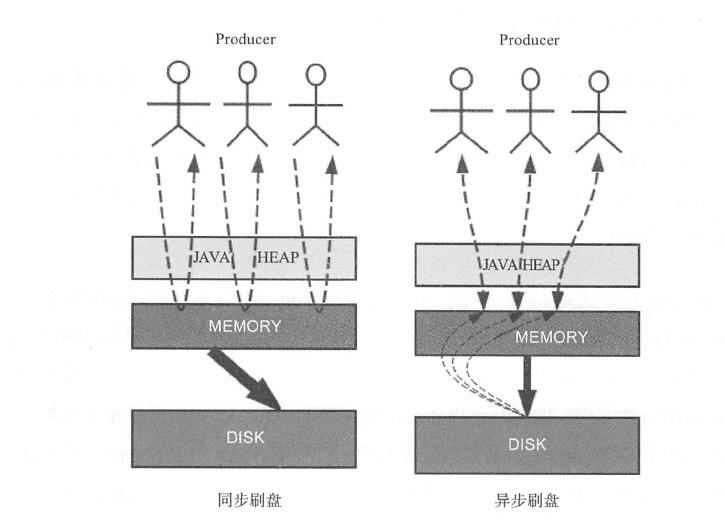

# RocketMQ服务搭建

## RocketMQ集群模式架构分析

### 单节点

优点： 本地开发测试，配置简单，同步刷盘消息一条都不会丢

缺点： 不可靠，如果宕机，会导致服务不可用

### 主从(异步，同步双写)

优点：同步双写消息不丢失，异步复制存在少量丢失，主节点宕机，从节点可以对外提供小傲心的消费吗，但是不支持写入。

缺点： 主备有毫秒级消息延迟，目前不支持自动切换，需要脚本或者其他程序进行检测然后进行停止kroker，重启让从节点成为主节点。

### 双主

优点：配置简单，可以靠配置RAID磁盘阵列保证消息可靠性，异步刷屏丢失少量消息。

缺点：master机器宕机期间，未被消费的消息在机器恢复之前不可消费，实时性会受到影响。

### 双主双从，多主多从（异步复制）

优点：磁盘损坏，消息丢失的非常少，消息实时性不会受影响，Master宕机后，消费者依然可以从Slave消费

缺点：主备有短暂消息延迟，毫秒级，如果Master宕机，磁盘损坏情况，会丢失少量消息

### 双主双从，多主多从模式(同步双写)

优点：同步双写方式，主备都写成功，才返回消息发送成功，服务可用性与数据可用性都非常高

缺点：性能比异步复制模式率低，主机宕机后，备机不能自动切换成为主机。


### 生产中推荐：

* 主从(异步、同步双写)
* 双主双从、多主多从模式(异步复制)
* 双主双从、多主多从模式(同步双写)


## 消息可靠


### 刷盘

刷盘是把内存PAGECACHE的消息写入磁盘中；刷盘的方式分为：同步刷盘、异步刷盘。

同步刷盘还是异步刷盘，是通过Broker配置文件里的flushDiskType参数设置的，这个参数被设置成SYNC_FLUSH、ASYNC_FLUSH中的一个

#### 同步刷盘

​	消息发送到broker端，在返回写成功状态时，消息已经被写入磁盘。具体的流程是：消息写入内存的PAGECACHE后，理解通知刷盘线程刷盘，然后等待刷盘完成，刷盘线程执行完成后唤醒等待的线程，返回消息写入成功的状态。

#### 异步刷盘(推荐)

​	生产者发送消息到broker端后，broker端在返回写发送成功状态时，消息可能只是被写入内存的PAGECACHE，写操作的返回快，吞吐量大；当内存里的消息积累到一定程度时，统一触发写磁盘操作，快速写入。


#### 同步刷盘和异步刷盘的区别

同步刷盘： 数据不丢失、吞吐量不高

异步刷盘：数据可能丢失、吞吐量高




### 复制

RocketMQ中的复制指的是，把master中的消息复制到Slave上，有同步和异步复制。

同步复制和异步复制是通过Broker配置文件里的brokerRole参数进行设置的，这个参数可以被设置成

* ASYNC_MASTER
* SYNC_MASTER
* SLAVE三个值中的一个。

#### 同步复制(推荐)

​	消费者发送消息后，broker的master接收到消息，然后等待master把消息发送到slave成功后，再返回消息发送成功状态给消费者。

#### 异步复制

​	消费者发送消息后，broker的master接收到消息，然后启动一个线程把消息发送到slave，master启动线程后直接返回消息发送成功状态给消费者，而不需要slave返回成功标识

#### 源码分析

我们知道生产者producer发送消息后，broker的处理入口是:BrokerController

```java
org.apache.rocketmq.broker.BrokerController#registerProcessor

public void registerProcessor() {
        /**
         * SendMessageProcessor，消息发送处理器
         */
        SendMessageProcessor sendProcessor = new SendMessageProcessor(this);
        sendProcessor.registerSendMessageHook(sendMessageHookList);
        sendProcessor.registerConsumeMessageHook(consumeMessageHookList);
		//发送消息，是
        this.remotingServer.registerProcessor(RequestCode.SEND_MESSAGE, sendProcessor, this.sendMessageExecutor);
        this.remotingServer.registerProcessor(RequestCode.SEND_MESSAGE_V2, sendProcessor, this.sendMessageExecutor);
        this.remotingServer.registerProcessor(RequestCode.SEND_BATCH_MESSAGE, sendProcessor, this.sendMessageExecutor);
        this.remotingServer.registerProcessor(RequestCode.CONSUMER_SEND_MSG_BACK, sendProcessor, this.sendMessageExecutor);
        this.fastRemotingServer.registerProcessor(RequestCode.SEND_MESSAGE, sendProcessor, this.sendMessageExecutor);
        this.fastRemotingServer.registerProcessor(RequestCode.SEND_MESSAGE_V2, sendProcessor, this.sendMessageExecutor);
        this.fastRemotingServer.registerProcessor(RequestCode.SEND_BATCH_MESSAGE, sendProcessor, this.sendMessageExecutor);
        this.fastRemotingServer.registerProcessor(RequestCode.CONSUMER_SEND_MSG_BACK, sendProcessor, this.sendMessageExecutor);
        /**
         * PullMessageProcessor
         */
        this.remotingServer.registerProcessor(RequestCode.PULL_MESSAGE, this.pullMessageProcessor, this.pullMessageExecutor);
        this.pullMessageProcessor.registerConsumeMessageHook(consumeMessageHookList);

        /**
         * QueryMessageProcessor
         */
        NettyRequestProcessor queryProcessor = new QueryMessageProcessor(this);
        this.remotingServer.registerProcessor(RequestCode.QUERY_MESSAGE, queryProcessor, this.queryMessageExecutor);
        this.remotingServer.registerProcessor(RequestCode.VIEW_MESSAGE_BY_ID, queryProcessor, this.queryMessageExecutor);

        this.fastRemotingServer.registerProcessor(RequestCode.QUERY_MESSAGE, queryProcessor, this.queryMessageExecutor);
        this.fastRemotingServer.registerProcessor(RequestCode.VIEW_MESSAGE_BY_ID, queryProcessor, this.queryMessageExecutor);

        /**
         * ClientManageProcessor
         */
        ClientManageProcessor clientProcessor = new ClientManageProcessor(this);
        this.remotingServer.registerProcessor(RequestCode.HEART_BEAT, clientProcessor, this.heartbeatExecutor);
        this.remotingServer.registerProcessor(RequestCode.UNREGISTER_CLIENT, clientProcessor, this.clientManageExecutor);
        this.remotingServer.registerProcessor(RequestCode.CHECK_CLIENT_CONFIG, clientProcessor, this.clientManageExecutor);

        this.fastRemotingServer.registerProcessor(RequestCode.HEART_BEAT, clientProcessor, this.heartbeatExecutor);
        this.fastRemotingServer.registerProcessor(RequestCode.UNREGISTER_CLIENT, clientProcessor, this.clientManageExecutor);
        this.fastRemotingServer.registerProcessor(RequestCode.CHECK_CLIENT_CONFIG, clientProcessor, this.clientManageExecutor);

        /**
         * ConsumerManageProcessor
         */
        ConsumerManageProcessor consumerManageProcessor = new ConsumerManageProcessor(this);
        this.remotingServer.registerProcessor(RequestCode.GET_CONSUMER_LIST_BY_GROUP, consumerManageProcessor, this.consumerManageExecutor);
        this.remotingServer.registerProcessor(RequestCode.UPDATE_CONSUMER_OFFSET, consumerManageProcessor, this.consumerManageExecutor);
        this.remotingServer.registerProcessor(RequestCode.QUERY_CONSUMER_OFFSET, consumerManageProcessor, this.consumerManageExecutor);

        this.fastRemotingServer.registerProcessor(RequestCode.GET_CONSUMER_LIST_BY_GROUP, consumerManageProcessor, this.consumerManageExecutor);
        this.fastRemotingServer.registerProcessor(RequestCode.UPDATE_CONSUMER_OFFSET, consumerManageProcessor, this.consumerManageExecutor);
        this.fastRemotingServer.registerProcessor(RequestCode.QUERY_CONSUMER_OFFSET, consumerManageProcessor, this.consumerManageExecutor);

        /**
         * EndTransactionProcessor
         */
        this.remotingServer.registerProcessor(RequestCode.END_TRANSACTION, new EndTransactionProcessor(this), this.endTransactionExecutor);
        this.fastRemotingServer.registerProcessor(RequestCode.END_TRANSACTION, new EndTransactionProcessor(this), this.endTransactionExecutor);

        /**
         * Default
         */
        AdminBrokerProcessor adminProcessor = new AdminBrokerProcessor(this);
        this.remotingServer.registerDefaultProcessor(adminProcessor, this.adminBrokerExecutor);
        this.fastRemotingServer.registerDefaultProcessor(adminProcessor, this.adminBrokerExecutor);
    }
```


SendMessageProcessor

```java
@Override
    public RemotingCommand processRequest(ChannelHandlerContext ctx,
                                          RemotingCommand request) throws RemotingCommandException {
        SendMessageContext mqtraceContext;
        switch (request.getCode()) {
            case RequestCode.CONSUMER_SEND_MSG_BACK:
                return this.consumerSendMsgBack(ctx, request);
            default:
                SendMessageRequestHeader requestHeader = parseRequestHeader(request);
                if (requestHeader == null) {
                    return null;
                }

                mqtraceContext = buildMsgContext(ctx, requestHeader);
                this.executeSendMessageHookBefore(ctx, request, mqtraceContext);

                RemotingCommand response;
                if (requestHeader.isBatch()) {
                    response = this.sendBatchMessage(ctx, request, mqtraceContext, requestHeader);
                } else {
                    response = this.sendMessage(ctx, request, mqtraceContext, requestHeader);
                }

                this.executeSendMessageHookAfter(response, mqtraceContext);
                return response;
        }
    }
```


 


### 主从模式如何保证消息可靠性


实际应用中要结合业务场景，合理设置刷盘方式和主从复制方式，尤其是SYNC_FLUSH方式，由于频繁

的触发写磁盘动作，会明显降低性能。通常情况下，应该把Master和Slave设置成ASYNC_FLUSH的刷盘方式，

主从之间配置成SYNC_MASTER的复制方式，这样即使有一台机器出故障，仍然可以保证数据不丢。


## 生产配置推荐

最终推荐这种方式: 同步(M-S同步复制)双写，异步刷盘


## 主从模式搭建

### 机器准备

| 主机名  | 主机IP         | 部署信息               | 备注   |
| ------- | -------------- | ---------------------- | ------ |
| servel1 | 192.168.10.110 | nameServer、Broker-a   | 主节点 |
| servel2 | 192.168.10.111 | nameServer、Broker-a-s | 主节点 |
| slave1  | 192.168.10.112 | Broker-b               | 从节点 |
| slave2  | 192.168.10.113 | Broker-b-s             | 从节点 |


### 修改server、broker的启动参数

> runServer.sh -- 修改servel1、servel2

```java
JAVA_OPT="${JAVA_OPT} - server -Xms256m -Xmx256m -Xmn256m -XX:MetaspaceSize=128m -xx:MaxMetaspaceSize=320m"
```

> runbroker.sh --修改 servel1、servel2、slave1、slave2

```java
JAVA_OPT="${JAVA_OPT} - server -Xms256m -Xmx256m -Xmn256m"
```

> servel1上的broker-a主节点

broker-a.properties文件

```properties
nameSrvAddr=192.168.10.110:9876;192.168.10.111:9876;
brokerClusterName=King_Cluster
brokerName=king-broker
brokerId=0
deleteWhen=04
fileReservedTime=48
brokerRole=SYNC_MASTER
flushDiskType=ASYNC_FLUSH
#默认自动创建topic队列的个数是4个
defaultTopicQueueNums=4
#是否允许自动创建Topic，建议线下开启，线上关闭
autoCreateTopicEnable=true
#是否允许自动创建订阅组，建议线下开启，线上关闭
autoCreateSubscriptionGroup=true
#存储路径，根据需求进行配置绝对路径，默认是home目录下
#storePathRootDir=
#storePathCommitLog=
```

启动命令：nohup sh bin/mqbroker -c conf/2m-2s-sync/broker-a.properties &

> servel2上的broker-a-s从节点

broker-a-s.properties文件

```properties
nameSrvAddr=192.168.10.110:9876;192.168.10.111:9876;
brokerClusterName=King_Cluster
brokerName=king-broker
brokerId=1
deleteWhen=04
fileReservedTime=48
brokerRole=SLAVE
flushDiskType=ASYNC_FLUSH
#默认自动创建topic队列的个数是4个
defaultTopicQueueNums=4
#是否允许自动创建Topic，建议线下开启，线上关闭
autoCreateTopicEnable=true
#是否允许自动创建订阅组，建议线下开启，线上关闭
autoCreateSubscriptionGroup=true
#存储路径，根据需求进行配置绝对路径，默认是home目录下
#storePathRootDir=
#storePathCommitLog=
```

启动命令：nohup sh bin/mqbroker -c conf/2m-2s-sync/broker-a-s.properties &

> slave1 broker-b主节点

broker-b.properties文件

```properties
nameSrvAddr=192.168.10.110:9876;192.168.10.111:9876;
brokerClusterName=King_Cluster
brokerName=king-broker
brokerId=0
deleteWhen=04
fileReservedTime=48
brokerRole=SYNC_MASTER
flushDiskType=ASYNC_FLUSH
#默认自动创建topic队列的个数是4个
defaultTopicQueueNums=4
#是否允许自动创建Topic，建议线下开启，线上关闭
autoCreateTopicEnable=true
#是否允许自动创建订阅组，建议线下开启，线上关闭
autoCreateSubscriptionGroup=true
#存储路径，根据需求进行配置绝对路径，默认是home目录下
#storePathRootDir=
#storePathCommitLog=
```

启动命令：nohup sh bin/mqbroker -c conf/2m-2s-sync/broker-b.properties &

> slave2 broker-b-s

broker-b-s.properties

```properties
nameSrvAddr=192.168.10.110:9876;192.168.10.111:9876;
brokerClusterName=King_Cluster
brokerName=king-broker
brokerId=0
deleteWhen=04
fileReservedTime=48
brokerRole=SLAVE
flushDiskType=ASYNC_FLUSH
#默认自动创建topic队列的个数是4个
defaultTopicQueueNums=4
#是否允许自动创建Topic，建议线下开启，线上关闭
autoCreateTopicEnable=true
#是否允许自动创建订阅组，建议线下开启，线上关闭
autoCreateSubscriptionGroup=true
#存储路径，根据需求进行配置绝对路径，默认是home目录下
#storePathRootDir=
#storePathCommitLog=
```

### 双主双从控制台配置

直接把rocketmq-console项目中的application.properties拷贝到和jar包同目录，然后修改

```properties
 rocketmq.config.namesrvAddr=192.168.10.110:9876;192.168.10.111:9876
```


### 常用命令参考

> 关闭防火墙

```shell
#centos 6.5
service iptables stop
#centos 7g
systemctl stop firewalld
systemctl stop firwalld.service
```

 ## 生产推荐配置

* topic创建线上禁止开启自动创建

* 一般是有专门的后台进行队列的CRUD，应用上线需要申请队列名称

* 生产环境推荐配置

  * NameServer配置多个不同机器多个节点
  * 多Master，每个Master带有Slave
  * 主从设置未SYNC_MASTER同步双写
  * Producer用同步方式投递消息到broker
  * 刷盘策略为SYNC_FLUSH(性能要求高的可以为ASYNC_FLUSH)

* 性能分析思路

  * CPU : top
  * 网卡： sar -n DEV 2 10、netstat -t、iperf3
  * 磁盘: iostat -xdm 1
  * JVM: jstack、jinfo、MAT

  