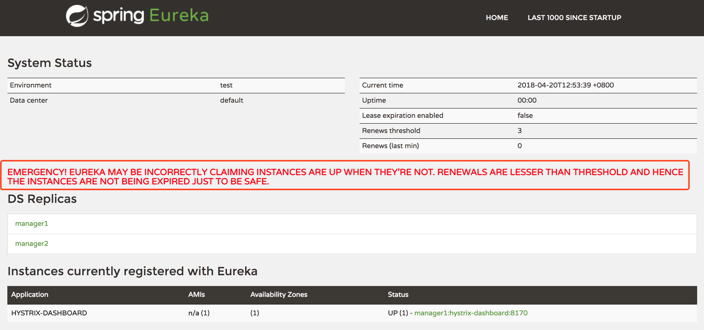

# SpringCloud服务注册Eureka

## 1、Eureka简介

​		Eureka是基于REST（Representational State Transfer）服务，主要以AWS云服务为支撑，提供服务发现并实现负载均衡和故障转移。我们称此服务为Eureka服务。Eureka提供了Java客户端组件，Eureka Client，方便与服务端的交互。客户端内置了基于round-robin实现的简单负载均衡。在Netflix，为Eureka提供更为复杂的负载均衡方案进行封装，以实现高可用，它包括基于流量、资源利用率以及请求返回状态的加权负载均衡。
​		在 Spring Cloud **微服务**架构中通常用作**注册中心**我们称这个服务为 Eureka Server，还有一个与之交互的客户端称之为 Eureka Client

## 2、Eureka核心要素

​		Eureka主要分为服务端(Eureka Server)、客户端(Eureka Client)。

### 2.1、Eureka Server

​		服务注册中心主要提供一下服务:

* 服务注册

  ​		Eureka Server对外提供一个REST接口，供客户端注册服务信息。

  * 服务注册接口地址: /eureka/apps/appID
  * 调用方式：POST
  * 服务注册中心之间会把注册的请求转发到集群中相连的其他注册中心，从而实现注册中心之间的服务同步。通过服务同步，两个服务提供者的服务信息就可以通过集群中的任意一台服务注册中心获得。同步注册信息时，会判断isReplication是否为true，为true就是复制，不会把信息复制带其他服务端，为false为新的服务注册，会把信息复制到其他服务端。

* 服务发现

  ​		Eureka Server对客户端提供查询注册信息接口，

  * 接口地址: /eureka/apps   
  * 调用方式:GET
  * 获取某个应用下的所有实例信息:  /eureka/apps/appID    GET方法
  * 获取某个应用下指定的实例: /eureka/apps/appID/instanceID  GET方法
  * 获取任意一个实例：/eureka/instances/instanceID  GET方法

* 服务续约

  ​		客户端在服务注册完成之后，服务提供者会维持一个心跳用来持续高烧Eureka Server“我还活着”，以防止Eureka Server的"剔除任务"将该服务实例从服务列表中排除出去，我们称该操作为服务续约。

  ```properties
  #服务失效时间，超过该时间就会被剔除
  eureka.instance.lease-expiration-duration-in-seconds=90
  #续约任务的调用时间间隔
  eureka.instance.lease-renewal-interval-in-seconds=30
  ```

  * 心跳续约接口地址：/eureka/apps/appID/instanceID
  * 调用方式：PUT

* 服务下线

  ​		在系统运行过程中必然会面临关闭或重启服务的某个实例的情况，在服务关闭期间，我们自然不希望客户端会继续调用关闭了的实例。所以在客户端程序中，当服务实例进行正常的关闭操作时，它会触发一个服务下线的REST请求给Eureka Server，告诉服务注册中心，该服务下线了。服务端收到请求后，将该服务状态设置为下线(DOWN)，并把该下线事件传播出去。

  * 服务下线接口地址：/eureka/apps/appID/instanceID
  * 调用方式：DELETE

* 失效剔除

  ​		有些时候，我们的服务实例并不一定会正常下线，可能由于内存溢出、网络故障等原因使得服务不能正常工作，而服务注册中心并没有收到"服务下线"的请求。为了从服务列表中将这些无法提供服务的实例剔除，Eureka Server在启动的时候会创建一个定时任务，默认每隔一段事件(默认为60秒)将当前清单中超时(默认为90秒)没有续约的服务剔除出去。

* 自我保护

  ​		当我们在本地调试基于Eureka的程序时，基本上都会碰到这样要给问题，在服务注册中心的信息版中出现类似下面的红色告警信息:

  ```java
  	EMERGENCY! EUREKA MAY BE INCORRECTLY CLAIMING INSTANCES ARE UP WHEN THEY’RE NOT. RENEWALS ARE LESSER THAN THRESHOLD AND HENCE THE INSTANCES ARE NOT BEING EXPIRED JUST TO BE SAFE.
  ```

  

  ​		实际上，该警告就是触发了Eureka Server的自我保护机制。服务注册到Eureka Server之后，会维持一个心跳连接，告诉Eureka Server自己还活着。Eureka Server在运行期间，会统计心跳失败的比例在15分钟之内是否低于85%，如果出现低于的情况，Eureka Server会将当前的实例信息保护起来，让这些实例不会过期，尽可能保护这些注册信息。但是，在这段保护期间内实例若出现问题，那么客户端很容易拿到实际已经不存在的服务实例，会出现调用失败的情况，所以客户端必须要有容错机制，比如可以使用请求重试、断路器等机制。

  ​			由于本地调试很容易触发注册中心的保护机制，这会使得注册中心维护的服务实例不那么准确。所以我们在本地进行开发的时候，可以使用eureka.server.enable-self-preservation=false参数来关闭自我保护机制，以确保注册中心可以将不可用的实例正确剔除。

### 2.2、Eureka Client


## 3、Eureka核心配置

### 3.1、Eureka Server相关配置

### 3.2、Eureka Client相关配置

## 4、Eureka源码解读

https://www.jianshu.com/p/4e43acbad7ae


https://blog.csdn.net/u012394095/article/details/81027286

### 4.1、服务注册


### 4.2、服务续约


### 4.3、服务解约


### 4.4、服务发现

